# google-ai-tech-academy-bootcamp-g52

## **Team Name**

**Solo Yolo**

## **Team Member**

|    | Name   | Title  | Socials     |
|----|--------|--------|-------------|
|  | Ramazan SALMAN | Product Owner / Scrum Master / Developer |  |

<!---->

## Game Name

**Echoes of Escape (EOE)**

## Game Description

 *Echoes of Escape* (EOE), oyuncuyu gizemli bir dünyaya hapsolmuş bir karakterin yerine koyar. Bu dünyadan kurtulmak için oyuncunun 3 farklı tapınakta gizlenmiş özel madenleri bulması ve bunları coin’e dönüştürmesi gerekir. Her bir coin, oyuncuya özgürlüğe bir adım daha yaklaştırır. Oyuncu 3 coin toplandığında büyülü bir arcade makinasına coinlerini atarak bu garip diyardan nihai kaçışı gerçekleştirebilir.  

 Oyun keşif, bulmaca çözme ve çevresel etkileşimlere odaklı şiddetsiz bir 3D deneyim sunar.

## Game Story

Oyuncu, bilinmeyen bir evrende üç kutsal tapınağa dağılmış olan antik madenleri bularak kendi ruhsal zincirlerini kırmak ve gerçekliğe geri dönmek zorundadır.

## Game Features

- 3D Low-Poly grafikler  
- Farklı biyomlar
- Maden toplama & coin dönüştürme sistemi  
- Tek oyunculu, hikaye destekli oynanış  
- Çevresel gizemler ve kapalı dünya atmosferi  
- Üç coin ile kaçış sistemi

## Target Audience

- Keşif tabanlı oyunları seven oyuncular  
- 13 yaş ve üzeri oyuncular (PG-13)
- Hikaye ve puzzle odaklı deneyim isteyenler  
- Bağımsız ve mistik atmosfer seven oyuncular

## Ingame Images

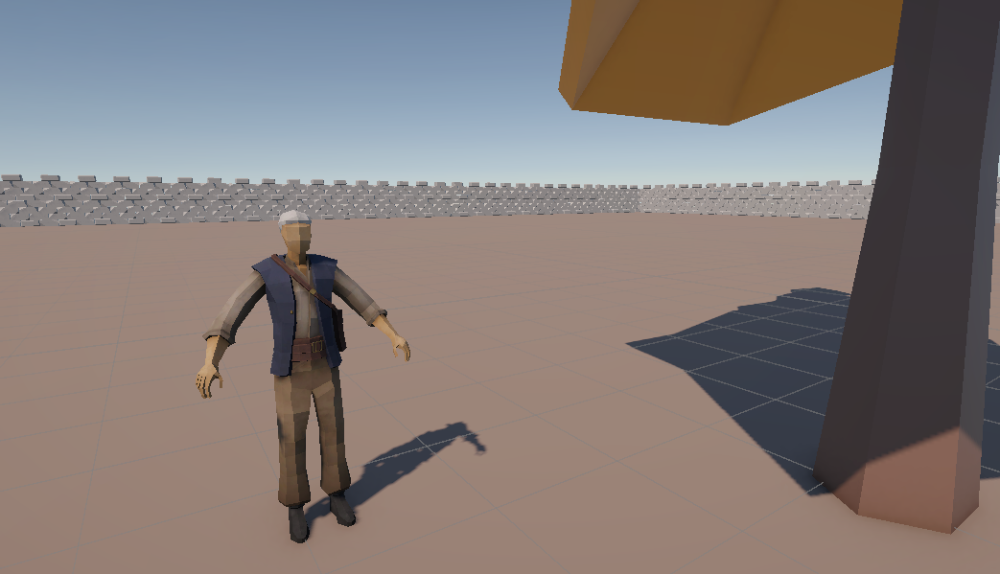

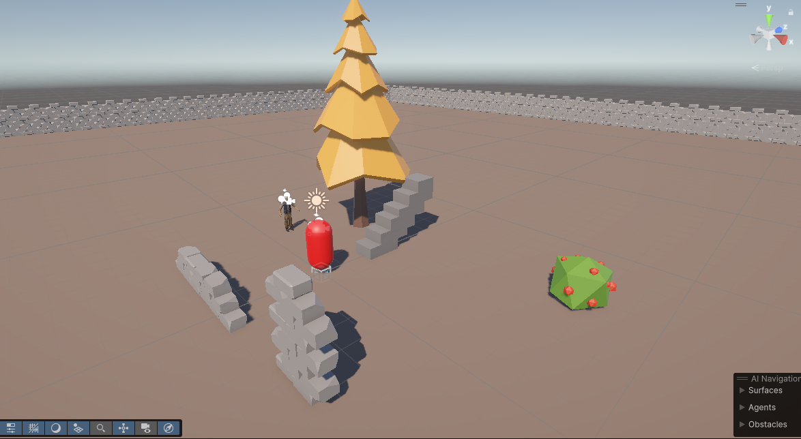

## Marketing Plan

**To Be Announced**

## Product Backlog URL

**Could not share JIRA Backlog with a public link so it will created on Miro**
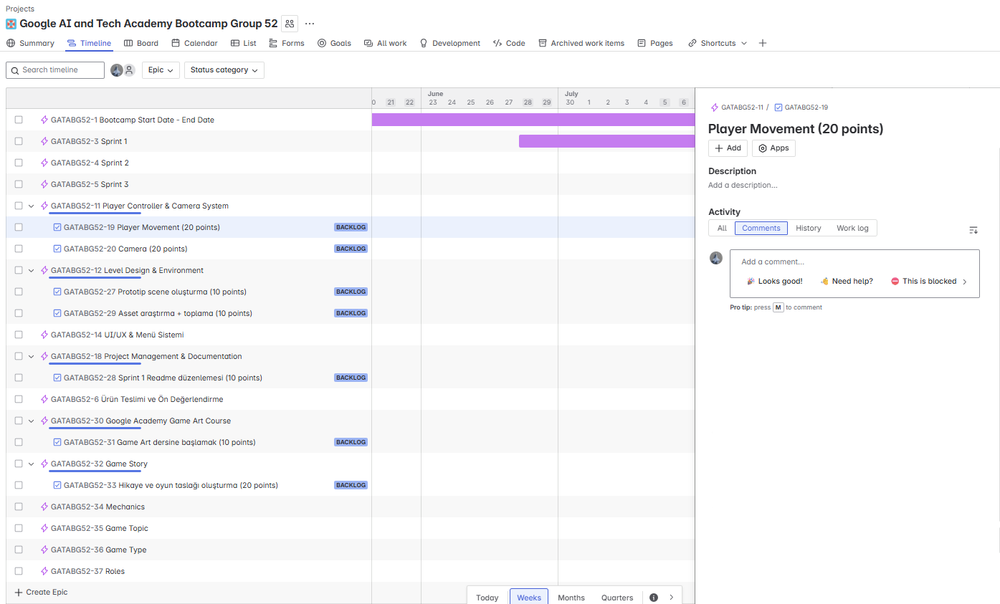

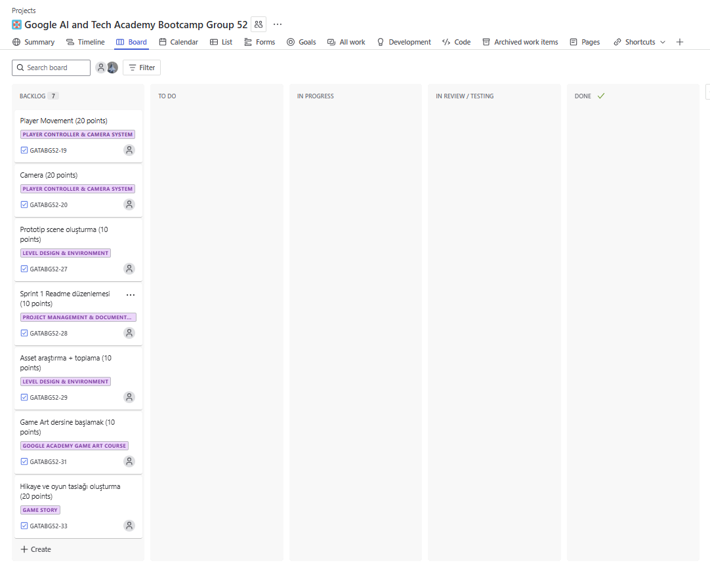

Jira'nın bağlantısı dış dünyayla paylaşılamadığı için **Miro** üzerinde sprint takibi yapılacaktır.  

[Miro Backlog Board - Coming Soon]

---

# Sprint 1 Documentation
Sprint boyunca aşağıdaki görevlerin tamamlanması hedeflenmiştir:  

- Proje yapısının kurulması  
- README dosyasının oluşturulması  
- Hikaye, hedef kitle ve temel oynanış fikirlerinin kağıt üzerinde planlanması  
- Jira üzerinden ilk backlog kartlarının tanımlanması  
- Unity projesinin başlatılması
- Oyun assetlerinin araştırılması
- Solo developer olarak takımda designer olmadığı için Google Akademi Eğitim Portalı üzerinden Game Art dersinin alınması.

## Sprint içinde tamamlanması tahmin edilen puan
Sprint 1 için temel kurulum ve konsept geliştirme adımlarına **10 puan** ayrılmıştır. 

| Görev                            | Tahmini Puan |
|----------------------------------|--------------|
| Hikaye ve oyun taslağı oluşturma | 20 puan      |
| Game Art dersine başlamak        | 10 puan      |
| Asset araştırma + toplama        | 10 puan      |
| Prototip scene oluşturma         | 10 puan      |
| Movement script yazımı           | 20 puan      |
| Kamera ayarları                  | 20 puan      |
| Sprint 1 Readme düzenlemesi      | 10 puan      |
| **Toplam**                       | **100 puan** |

## Sprint Review  
- Sprint boyunca belirlenen hedefler başarıyla tamamlandı.  
- Teknik yapı kuruldu.
- Proje artık ilerleyen sprintlerde kullanılacak temel yapıya sahip.  

## Sprint Retrospective  
- Zaman yönetimi tek kişi için yoğun olsa da kontrollü şekilde sürdürüldü.  
- Günlük notlar sprint sonunda derlenerek belge haline getirildi.  
- Tek kişilik bir takım olduğu için proje ilerideki sprintlerde 3D'den 2D'ye çevirilebilir.
- İlk sprint genel olarak "game art" dersini takip etmek, benzer oyunların araştırmasını yapmak ve asset aramakla geçti.

# Sprint 2 Documentation
Sprint boyunca aşağıdaki görevlerin tamamlanması hedeflenmiştir:  

- Başlangıç haritasını (Starting Leveli) oluşturmak (20 points)  
- Game art dersini tamamlamak ve 3d designa başlamak (10 points)
- Bir adet basit bir temple tasarlamak (20 points)  
- Sprint 2 Readme düzenlemesi (10 points)  
- Temple içine engeller eklemek (spıke, labirent, platforms) (20 points)
- Smooth movement controls (5 points)
- Add Sky (5 points)
- Add guide NPC (5 points)
- Add Dummy NPCs (5 points)

## Sprint içinde tamamlanması tahmin edilen puan
Sprint 2 için temel kurulum ve konsept geliştirme adımlarına **10 puan** ayrılmıştır. 

| Görev                            | Tahmini Puan |
|----------------------------------|--------------|
| Başlangıç haritasını (Starting Leveli) oluşturmak                     | 20 puan      |
| Game art dersini tamamlamak ve 3d designa başlamak                    | 10 puan      |
| Bir adet basit bir temple tasarlamak                                  | 20 puan      |
| Temple içine engeller eklemek (spike, labirent, platforms)            | 20 puan      |
| Smooth movement controls                                              | 5 puan       |
| Add Sky                                                               | 5 puan       |
| Add guide NPC                                                         | 5 puan       |
| Add Dummy NPCs                                                        | 5 puan       |
| Sprint 2 Readme düzenlemesi                                           | 10 puan      |
| **Toplam**                       | **100 puan** |

## Sprint Review  
- Sprint boyunca belirlenen hedeflerin çoğu başarıyla tamamlandı.   

## Sprint Retrospective  
- Tek kişi olunduğu için başlangıç haritası ve temple basit tutuldu.  
- Günlük notlar sprint sonunda derlenerek belge haline getirildi.
- "game art" dersi bitirildi.

## Sprint 2 Images 
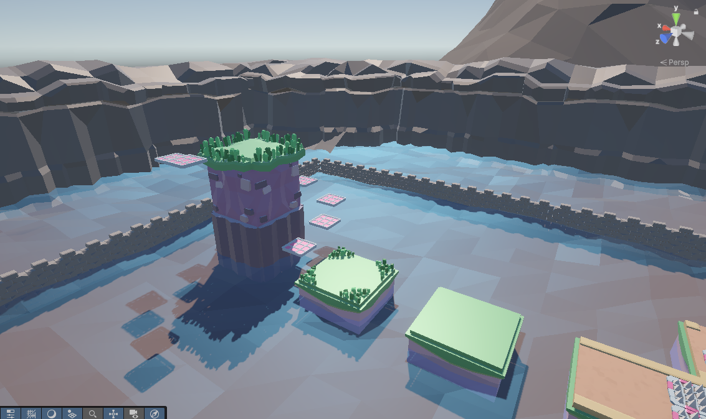
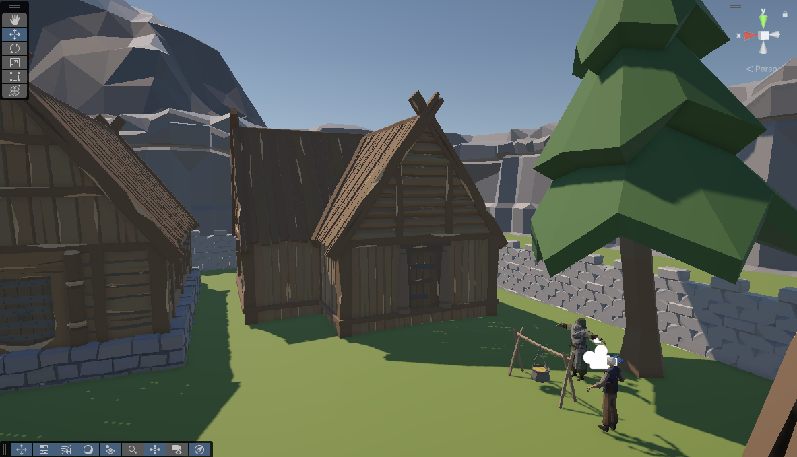

# Sprint 3 Documentation

Sprint boyunca aşağıdaki görevlerin tamamlanması hedeflenmiştir:  

- Add Dummy NPCs
- Ana Menü ve bitiş menüsü tasarımı
- Spike yeniden başlama, suya düşünce platform başından başlamak
- Temple düzenlemesi
- Toplanabilir obje eklemek
- Platform asseti bulmak
- Bitiş interaction oluşturmak
- Sprint 3 Readme düzenlemesi

# Sprint 3 Images
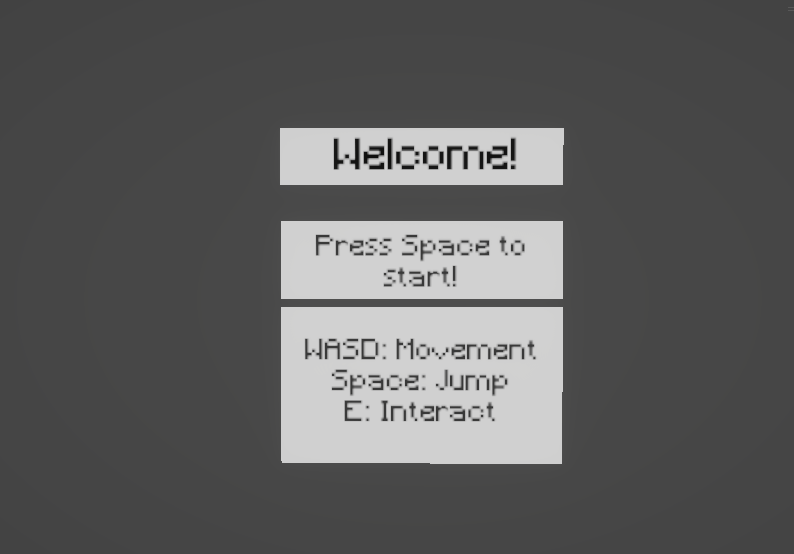
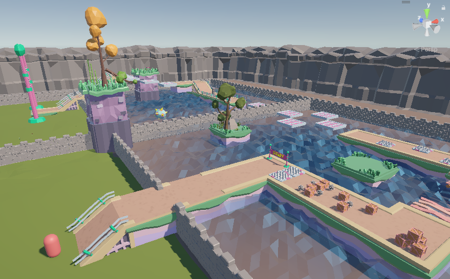
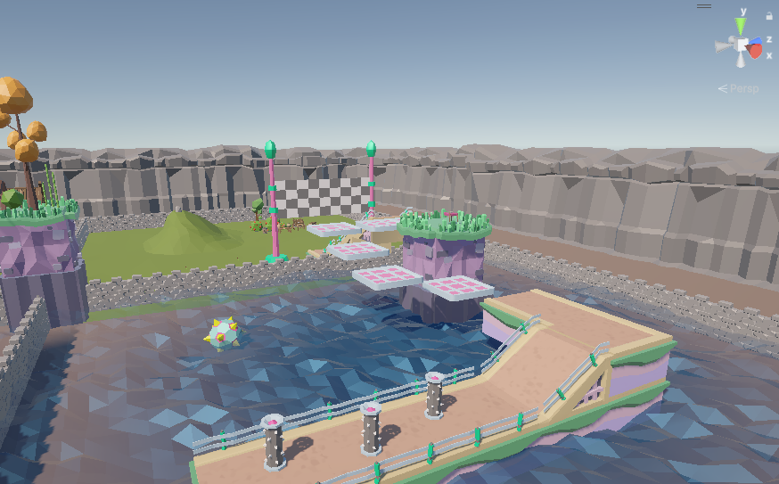
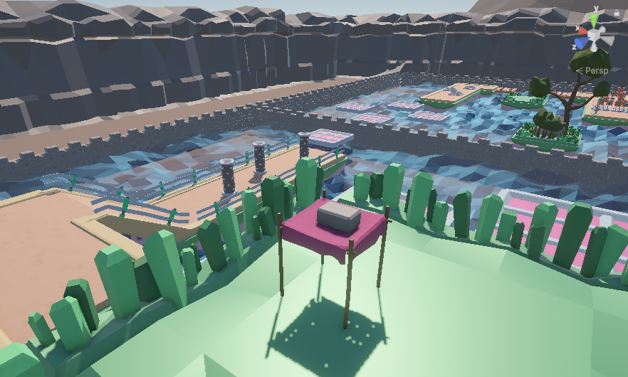
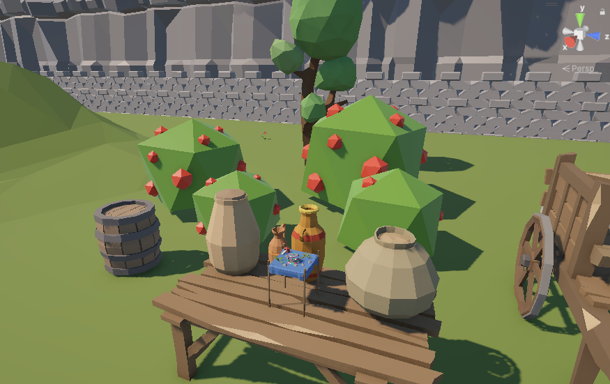

## Sprint içinde tamamlanması tahmin edilen puan
Sprint 3 için temel kurulum ve konsept geliştirme adımlarına **10 puan** ayrılmıştır. 

| Görev                            | Tahmini Puan |
|----------------------------------|--------------|
| Add Dummy NPCs                                                        | 10 puan      |
| Ana Menü ve bitiş menüsü tasarımı                                    | 10 puan      |
| Spike yeniden başlama, suya düşünce platform başından başlamak        | 20 puan      |
| Temple düzenlemesi                                                    | 20 puan      |
| Toplanabilir obje eklemek                                             | 10 puan      |
| Platform asseti bulmak                                                | 10 puan      |
| Bitiş interaction oluşturmak                                          | 10 puan      |
| Sprint 3 Readme düzenlemesi                                           | 10 puan      |
| **Toplam**                       | **100 puan** |

Süreç boyunca birçok backlog itemi tamamlanmış olup hikaye biraz değiştmiştir.

-Tutorial sahnesindeki temple, platformlar ve engeller düzenlendi.
-Toplanabilir obje (hikayedeki coin cevher olarak eklendi)
-Tapınak engelleri sonrası bitiş için yer oluşturuldu. Bu alana büyülü bir arcade makinası yerine toplanan cevherin konulacağı sunak eklendi.
-Menü tasarımları yapıldı.

### Tamamlanacak backlog itemleri
- Add Dummy NPCs  
- Ana Menü ve bitiş menüsü tasarımı yapıldı, oyuna eklenecek.

### Demo YouTube Link
https://youtu.be/th9_dkY95dA

### Demo
Oyunun demosunu "google-ai-tech-academy-bootcamp-g52\DemoBuild" klasörü içindeki "ProjectFoxtrotTango.exe" dosyasına tıklayarak deneyebilirsiniz.

## Document History  

- v1.4: Readme.md dosyası Sprint 3 için güncellendi.
- v1.3: Readme.md dosyası Sprint 2 için güncellendi.
- v1.2: Sprint 1 için Jira ekran görüntüleri ve oyun içi görüntüler eklendi.
- v1.1: Sprint 1 eklendi.
- v1.0: Dosya oluşturuldu.